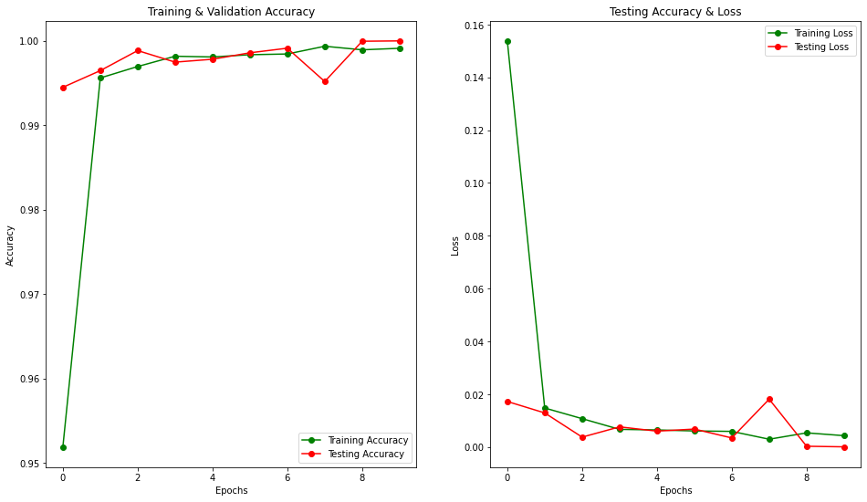

# Sign_Language_Gestures_Detection

## [American Sign Language Dataset](https://www.kaggle.com/datasets/kapillondhe/american-sign-language)

</img>

# Implementation

## Libraries

-   [Tensorflow](https://www.tensorflow.org/)
-   [keras](https://keras.io/)

## **CNN (Using Keras)**

|          LAYER (type)           |    OUTPUT SHAPE    |
| :-----------------------------: | :----------------: |
|     rescaling_1 (Rescaling)     | (None, 32, 32, 3)  |
|         conv2d (Conv2D)         | (None, 32, 32, 16) |
|  max_pooling2d (MaxPooling2D)   | (None, 16, 16, 16) |
|        conv2d_1 (Conv2D)        | (None, 16, 16, 32) |
| max_pooling2d_1 (MaxPooling 2D) |  (None, 8, 8, 32)  |
|        conv2d_2 (Conv2D)        |  (None, 8, 8, 64)  |
| max_pooling2d_2 (MaxPooling 2D) |  (None, 4, 4, 64)  |
|        flatten (Flatten)        |    (None, 1024)    |
|          dense (Dense)          |    (None, 128)     |
|         dense_1 (Dense)         |     (None, 28)     |

### Visualization of the training Results

</img>
